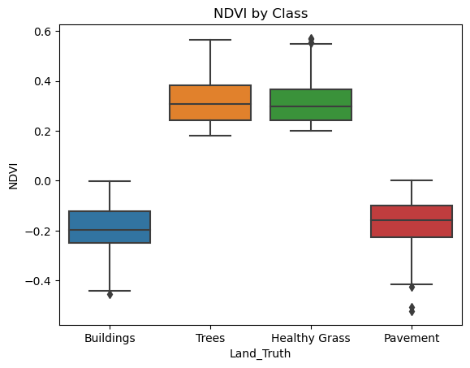
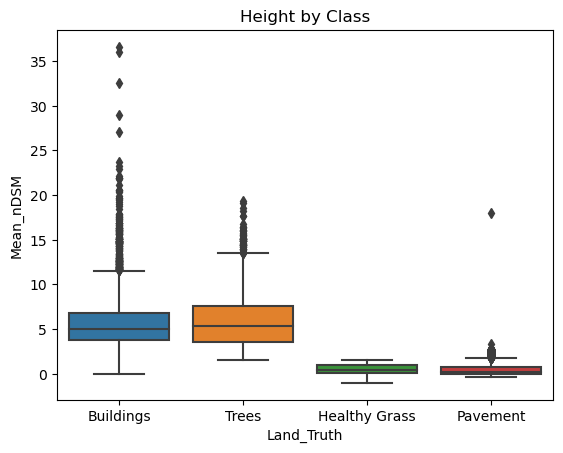
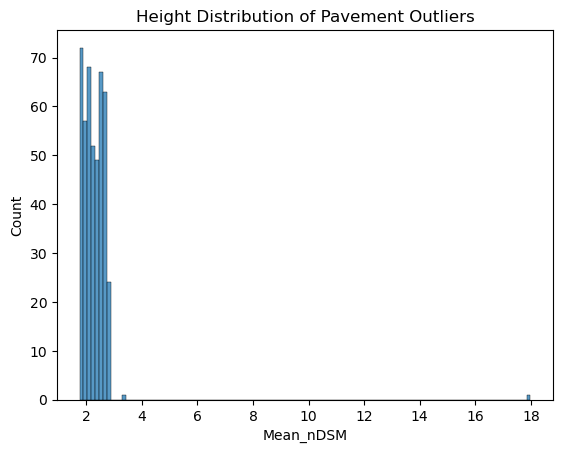
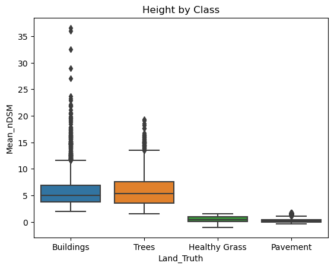
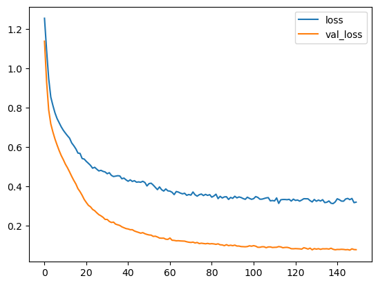

```python
import os
import glob
import pandas as pd
import geopandas as gpd
import numpy as np
import matplotlib.pyplot as plt
import seaborn as sns
import pickle
%matplotlib inline
```

Known Land Cover types were derived from classified objects built in eCognition. An accuracy assessment of these classes held 90+% accuracy of each land cover type. 

Land Cover Types
- Buildings
- Pavement
- Trees
- Healthy Grass

Each class contained upwards of 800k objects with the following spectral metrics. These metrics will be the features used to train the neural network.
- Mean Red: Mean Red value of object
- Mean Green: Mean Green value of object
- Mean Blue: Mean Blue value of object
- Mean NIR: Mean Near-infrared of object
- Mean nDSM: Mean elevation of object
- NDVI: Vegation Indice (Mean NIR - Mean Red) / (Mean NIR + Mean Red) (i.e. proxy for impervious/pervious surfaces)
- Std. DSM: Standard deviation of elevation in object (i.e. proxy for smoothness)

For speed purposes, I have only selected 4000 records from each class. These records will be combined in a single dataframe and then used to train and test the neural network.


```python
all_df = pd.DataFrame()
for fi in glob.glob('Inputs/*.shp'):    
    df = gpd.read_file(os.path.abspath(fi))
    sample = df.loc[:, ['Land_Truth', 
                        'Mean_Red', 
                        'Mean_Green', 
                        'Mean_Blue', 
                        'Mean_NIR', 
                        'Mean_nDSM', 
                        'NDVI', 
                        'sd_dsm']].sample(4000)
    
    all_df = pd.concat([all_df, sample])
    print(fi)

# shuffle dataframe
all_df = all_df.sample(frac=1).reset_index(drop=True)
all_df.head()
```

    Inputs\Buildings.shp
    Inputs\HealthyGrass.shp
    Inputs\Pavement.shp
    Inputs\Trees.shp
    


<div>
<style scoped>
    .dataframe tbody tr th:only-of-type {
        vertical-align: middle;
    }

    .dataframe tbody tr th {
        vertical-align: top;
    }

    .dataframe thead th {
        text-align: right;
    }
</style>
<table border="1" class="dataframe">
  <thead>
    <tr style="text-align: right;">
      <th></th>
      <th>Land_Truth</th>
      <th>Mean_Red</th>
      <th>Mean_Green</th>
      <th>Mean_Blue</th>
      <th>Mean_NIR</th>
      <th>Mean_nDSM</th>
      <th>NDVI</th>
      <th>sd_dsm</th>
    </tr>
  </thead>
  <tbody>
    <tr>
      <th>0</th>
      <td>Buildings</td>
      <td>170.275510</td>
      <td>157.928571</td>
      <td>131.938776</td>
      <td>111.326531</td>
      <td>3.601077</td>
      <td>-0.209334</td>
      <td>1.318128</td>
    </tr>
    <tr>
      <th>1</th>
      <td>Trees</td>
      <td>68.782258</td>
      <td>84.596774</td>
      <td>69.387097</td>
      <td>173.693548</td>
      <td>2.769680</td>
      <td>0.432667</td>
      <td>2.363513</td>
    </tr>
    <tr>
      <th>2</th>
      <td>Healthy Grass</td>
      <td>74.171429</td>
      <td>83.028571</td>
      <td>70.200000</td>
      <td>147.000000</td>
      <td>0.735676</td>
      <td>0.329286</td>
      <td>1.151501</td>
    </tr>
    <tr>
      <th>3</th>
      <td>Pavement</td>
      <td>145.727273</td>
      <td>133.363636</td>
      <td>122.727273</td>
      <td>102.545455</td>
      <td>0.022228</td>
      <td>-0.173929</td>
      <td>0.051500</td>
    </tr>
    <tr>
      <th>4</th>
      <td>Pavement</td>
      <td>116.121951</td>
      <td>119.414634</td>
      <td>116.804878</td>
      <td>75.658537</td>
      <td>0.251256</td>
      <td>-0.210988</td>
      <td>0.507209</td>
    </tr>
  </tbody>
</table>
</div>


## Exploratory Data Analysis
The following creates a few figures to highlight some of the main distinctions between impervious and pervious surfaces. This distinction is very important when combined with the Mean nDSM attribute which can then further delineate each class. 


```python
sns.boxplot(data=all_df, x='Land_Truth', y='NDVI')
plt.title('NDVI by Class')

```


    Text(0.5, 1.0, 'NDVI by Class')


    

    


```python
sns.boxplot(data=all_df, x='Land_Truth', y='Mean_nDSM')
plt.title('Height by Class')
```


    Text(0.5, 1.0, 'Height by Class')


    

    


## Clean Data
Based on the above figures we see a few distinctions. First off, both impervious classes (buildings, pavement) have low NDVI values, whereas pervious(grass, trees) have high NDVI values. This makes sense as vegetation reflect more NIR whereas man-made structures reflect more Red. 

Secondly, height (elevation) for each class intutively makes sense: Buildings and Trees are much taller, whereas Pavement and Healthy Grass have values at or around 0-meters. Buildings primarily consist of heights around 5 to 7 meter with a large collection of outliers ranging upward of 40-meters. This makes sense as much of the imagery consist of residental neighborhoods with regular sized homes (5-7 meters or 15-20 feet), and a small downtown area containing much taller buildings. 

It's important to note that the Pavement class has a small colleciton of outliers with heights around 5-meters. This may be incorrect values and something that could be removed to give a better represenation of the class. These particular outliers could be objects that were not segmented quite well and could contain a mixture of other classes. 

### Identify the relatively high nDSM values in the Pavement class

From a look of the distribution of the Mean_nDSM metric, we can see that the marjority of the values (75%) are within 0.73 meters. To find the group of outliers we can use the traditional definition of an outlier which is IQR * 1.5. Since are outliers are all high, then the calculation would be Q3 + IQR*1.5


```python
pavement_stats = all_df[all_df['Land_Truth'] == 'Pavement'].describe(percentiles=[.25,.5,.75,.9]).T
pavement_stats
```


<div>
<style scoped>
    .dataframe tbody tr th:only-of-type {
        vertical-align: middle;
    }

    .dataframe tbody tr th {
        vertical-align: top;
    }

    .dataframe thead th {
        text-align: right;
    }
</style>
<table border="1" class="dataframe">
  <thead>
    <tr style="text-align: right;">
      <th></th>
      <th>count</th>
      <th>mean</th>
      <th>std</th>
      <th>min</th>
      <th>25%</th>
      <th>50%</th>
      <th>75%</th>
      <th>90%</th>
      <th>max</th>
    </tr>
  </thead>
  <tbody>
    <tr>
      <th>Mean_Red</th>
      <td>4000.0</td>
      <td>150.387076</td>
      <td>27.138330</td>
      <td>58.938053</td>
      <td>128.131448</td>
      <td>151.993007</td>
      <td>172.658046</td>
      <td>185.684904</td>
      <td>219.000000</td>
    </tr>
    <tr>
      <th>Mean_Green</th>
      <td>4000.0</td>
      <td>146.046759</td>
      <td>27.228277</td>
      <td>65.473451</td>
      <td>123.994444</td>
      <td>146.369048</td>
      <td>167.184436</td>
      <td>182.636675</td>
      <td>216.250000</td>
    </tr>
    <tr>
      <th>Mean_Blue</th>
      <td>4000.0</td>
      <td>139.730006</td>
      <td>27.138152</td>
      <td>72.042035</td>
      <td>119.493416</td>
      <td>137.914545</td>
      <td>158.000000</td>
      <td>177.768485</td>
      <td>216.666667</td>
    </tr>
    <tr>
      <th>Mean_NIR</th>
      <td>4000.0</td>
      <td>109.853907</td>
      <td>30.261047</td>
      <td>36.373894</td>
      <td>85.562355</td>
      <td>106.314286</td>
      <td>134.491279</td>
      <td>152.421863</td>
      <td>206.166667</td>
    </tr>
    <tr>
      <th>Mean_nDSM</th>
      <td>4000.0</td>
      <td>0.551719</td>
      <td>0.788938</td>
      <td>-0.329121</td>
      <td>0.033971</td>
      <td>0.195804</td>
      <td>0.724106</td>
      <td>1.870215</td>
      <td>17.983565</td>
    </tr>
    <tr>
      <th>NDVI</th>
      <td>4000.0</td>
      <td>-0.165541</td>
      <td>0.077975</td>
      <td>-0.521859</td>
      <td>-0.227684</td>
      <td>-0.157618</td>
      <td>-0.099734</td>
      <td>-0.072051</td>
      <td>0.002335</td>
    </tr>
    <tr>
      <th>sd_dsm</th>
      <td>4000.0</td>
      <td>0.678583</td>
      <td>0.735593</td>
      <td>0.000000</td>
      <td>0.086232</td>
      <td>0.450639</td>
      <td>1.023442</td>
      <td>1.756214</td>
      <td>5.950402</td>
    </tr>
  </tbody>
</table>
</div>


```python
PAVEMENT_Q3 = pavement_stats.loc['Mean_nDSM', '75%']
PAVEMENT_Q1 = pavement_stats.loc['Mean_nDSM', '25%']	
OUTLIER_PAVEMENT = PAVEMENT_Q3 + ((PAVEMENT_Q3 - PAVEMENT_Q1)*1.5)

# locate outliers
pavement_outlier = all_df[(all_df['Land_Truth'] == 'Pavement') & 
       (all_df['Mean_nDSM'] >= (OUTLIER_PAVEMENT))]

print(pavement_outlier['Mean_nDSM'].describe().T)
```

    count    454.000000
    mean       2.304387
    std        0.800281
    min        1.759774
    25%        2.001235
    50%        2.276442
    75%        2.539732
    max       17.983565
    Name: Mean_nDSM, dtype: float64
    


```python
# histogram to show distribution of the Pavement Outliers
sns.histplot(pavement_outlier['Mean_nDSM'])
plt.title('Height Distribution of Pavement Outliers')
```


    Text(0.5, 1.0, 'Height Distribution of Pavement Outliers')


    

    


It is important to ensure each labelled class has clear and distinct characteristics. Since the whole thing clearly differentating Pavement from the Buildings class is the Mean_nDSM attribute it is important to ensure values do not overlap from each class.

The next step will be to look at the low end of heights in the Buildings Mean_nDSM distribution and identify a threshold to use for the Pavement class. Conversely, Buildings that overlap in height (i.e. within 2 std (75%)) should be removed. 

I have chosen to drop these outliers. In some cases, it may be smarter to reclassify these objects. 


```python
all_df[all_df['Land_Truth'] == 'Buildings'].describe().T

```


<div>
<style scoped>
    .dataframe tbody tr th:only-of-type {
        vertical-align: middle;
    }

    .dataframe tbody tr th {
        vertical-align: top;
    }

    .dataframe thead th {
        text-align: right;
    }
</style>
<table border="1" class="dataframe">
  <thead>
    <tr style="text-align: right;">
      <th></th>
      <th>count</th>
      <th>mean</th>
      <th>std</th>
      <th>min</th>
      <th>25%</th>
      <th>50%</th>
      <th>75%</th>
      <th>max</th>
    </tr>
  </thead>
  <tbody>
    <tr>
      <th>Mean_Red</th>
      <td>4000.0</td>
      <td>149.255051</td>
      <td>29.590927</td>
      <td>100.034014</td>
      <td>124.716667</td>
      <td>147.230952</td>
      <td>172.043756</td>
      <td>223.531250</td>
    </tr>
    <tr>
      <th>Mean_Green</th>
      <td>4000.0</td>
      <td>145.519586</td>
      <td>30.639503</td>
      <td>74.833333</td>
      <td>121.001437</td>
      <td>142.053977</td>
      <td>167.939516</td>
      <td>227.543478</td>
    </tr>
    <tr>
      <th>Mean_Blue</th>
      <td>4000.0</td>
      <td>140.681078</td>
      <td>33.216099</td>
      <td>70.270270</td>
      <td>115.296875</td>
      <td>135.000000</td>
      <td>163.300183</td>
      <td>229.739130</td>
    </tr>
    <tr>
      <th>Mean_NIR</th>
      <td>4000.0</td>
      <td>105.520783</td>
      <td>35.334896</td>
      <td>41.669492</td>
      <td>77.800164</td>
      <td>97.704793</td>
      <td>127.005952</td>
      <td>210.438017</td>
    </tr>
    <tr>
      <th>Mean_nDSM</th>
      <td>4000.0</td>
      <td>5.825133</td>
      <td>3.092533</td>
      <td>0.002874</td>
      <td>3.736427</td>
      <td>5.028741</td>
      <td>6.862039</td>
      <td>36.604897</td>
    </tr>
    <tr>
      <th>NDVI</th>
      <td>4000.0</td>
      <td>-0.186150</td>
      <td>0.087308</td>
      <td>-0.452847</td>
      <td>-0.250000</td>
      <td>-0.196420</td>
      <td>-0.122261</td>
      <td>-0.000438</td>
    </tr>
    <tr>
      <th>sd_dsm</th>
      <td>4000.0</td>
      <td>1.468801</td>
      <td>1.149948</td>
      <td>0.004944</td>
      <td>0.643029</td>
      <td>1.201237</td>
      <td>2.003143</td>
      <td>13.494210</td>
    </tr>
  </tbody>
</table>
</div>


```python
PAVEMENT_90PERCENTILE = pavement_stats.loc['Mean_nDSM', '90%']

bad_pavement = all_df[(all_df['Land_Truth'] == 'Pavement') &
       (all_df['Mean_nDSM'] >= OUTLIER_PAVEMENT)]


bad_buildings = all_df[(all_df['Land_Truth'] == 'Buildings') &
       (all_df['Mean_nDSM'] <= PAVEMENT_90PERCENTILE)]

all_bad = pd.concat([bad_pavement, bad_buildings])
all_df_clean = all_df.drop(all_bad.index)
```


```python
sns.boxplot(data=all_df_clean, x='Land_Truth', y='Mean_nDSM')
plt.title('Height by Class')
```


    Text(0.5, 1.0, 'Height by Class')


    

    


The figure above, shows a better delineation of each class after removing some of the outliers in the Pavement class and reducing the lower-Quartile of the Buildings class to ensure minimal overlap. 

## Model Development
Deep Neural Network using a rectified linear unit for the activation funciton. This will be a mutually exclusive multi-classification model. For this, labels need to be converted to dummy variables. 

### - Healthy Grass = 0
### - Trees = 1
### - Pavement = 2
### - Buildings = 3


```python
# convert labels (Land Truth to integers)
def convert_labels(x):
    if x == 'Healthy Grass':
        return 0
    elif x == 'Trees':
        return 1
    elif x == 'Pavement':
        return 2
    else:
        return 3 # Buildings

all_df_clean['Class'] = all_df_clean['Land_Truth'].apply(lambda x: convert_labels(x))
all_df_clean = all_df_clean.drop('Land_Truth', axis=1)
all_df_clean.head(1)
```


<div>
<style scoped>
    .dataframe tbody tr th:only-of-type {
        vertical-align: middle;
    }

    .dataframe tbody tr th {
        vertical-align: top;
    }

    .dataframe thead th {
        text-align: right;
    }
</style>
<table border="1" class="dataframe">
  <thead>
    <tr style="text-align: right;">
      <th></th>
      <th>Mean_Red</th>
      <th>Mean_Green</th>
      <th>Mean_Blue</th>
      <th>Mean_NIR</th>
      <th>Mean_nDSM</th>
      <th>NDVI</th>
      <th>sd_dsm</th>
      <th>Class</th>
    </tr>
  </thead>
  <tbody>
    <tr>
      <th>0</th>
      <td>170.27551</td>
      <td>157.928571</td>
      <td>131.938776</td>
      <td>111.326531</td>
      <td>3.601077</td>
      <td>-0.209334</td>
      <td>1.318128</td>
      <td>3</td>
    </tr>
  </tbody>
</table>
</div>


```python
from sklearn.model_selection import train_test_split
```

Features have been split at a 70/30 ratio
- 70% for Training
- 30% for Testing


```python
X = all_df_clean.drop('Class',axis=1).values # features
y = all_df_clean['Class'].values # labels
X_train, X_test, y_train, y_test = train_test_split(X, y, test_size=0.30, random_state=10)
```

### Normalize Data
Normalizing is required if features are of different units. Here I have used a basic MinMax which transforms each value between 0 and 1, while perserving the intra-relationship (ratios) of features.


```python
from sklearn.preprocessing import MinMaxScaler
```


```python
scaler = MinMaxScaler()
X_train = scaler.fit_transform(X_train) # only fit to traning data!
X_test = scaler.transform(X_test) # transform 
```

### Create and compile model
The model's first layer has 7 neurons since there are 7 features. For simplicity's sake I've only included one hidden layer that contains about half the nuerons in the first layer. The last layer uses a softmax function since this is a multi-classificaiton model. 


```python
import tensorflow as tf
from tensorflow.keras.models import Sequential
from tensorflow.keras.layers import Dense, Activation,Dropout
from tensorflow.keras.constraints import max_norm
```


```python
model = Sequential()

# input layer
model.add(Dense(8,  activation='relu'))
model.add(Dropout(0.2))

# hidden layer
model.add(Dense(5, activation='relu'))
model.add(Dropout(0.2))

# output layer
model.add(Dense(4,activation='softmax'))

# Compile model
model.compile(loss='sparse_categorical_crossentropy', optimizer='adam')
```

### Train Model


```python
from tensorflow.keras.callbacks import EarlyStopping
```


```python
early_stop = EarlyStopping(monitor='val_loss', mode='min', verbose=1, patience=25)
```


```python
model.fit(x=X_train, 
          y=y_train, 
          epochs=150,
          batch_size=100,
          validation_data=(X_test, y_test), 
          verbose=1,
          callbacks=[early_stop]
          )
```

    Epoch 1/150
    109/109 [==============================] - 1s 4ms/step - loss: 1.2548 - val_loss: 1.1382
    Epoch 2/150
    109/109 [==============================] - 0s 2ms/step - loss: 1.0929 - val_loss: 0.9333
    Epoch 3/150
    109/109 [==============================] - 0s 3ms/step - loss: 0.9488 - val_loss: 0.7899
    Epoch 4/150
    109/109 [==============================] - 0s 2ms/step - loss: 0.8548 - val_loss: 0.7186
    Epoch 5/150
    109/109 [==============================] - 0s 2ms/step - loss: 0.8126 - val_loss: 0.6778
    Epoch 6/150
    109/109 [==============================] - 0s 2ms/step - loss: 0.7747 - val_loss: 0.6419
    Epoch 7/150
    109/109 [==============================] - 0s 3ms/step - loss: 0.7457 - val_loss: 0.6114
    Epoch 8/150
    109/109 [==============================] - 0s 2ms/step - loss: 0.7243 - val_loss: 0.5830
    Epoch 9/150
    109/109 [==============================] - 0s 3ms/step - loss: 0.7033 - val_loss: 0.5575
    Epoch 10/150
    109/109 [==============================] - 0s 4ms/step - loss: 0.6858 - val_loss: 0.5367
    Epoch 11/150
    109/109 [==============================] - 0s 4ms/step - loss: 0.6714 - val_loss: 0.5136
    Epoch 12/150
    109/109 [==============================] - 0s 4ms/step - loss: 0.6580 - val_loss: 0.4952
    Epoch 13/150
    109/109 [==============================] - 0s 2ms/step - loss: 0.6456 - val_loss: 0.4742
    Epoch 14/150
    109/109 [==============================] - 0s 2ms/step - loss: 0.6217 - val_loss: 0.4519
    Epoch 15/150
    109/109 [==============================] - 0s 2ms/step - loss: 0.6075 - val_loss: 0.4315
    Epoch 16/150
    109/109 [==============================] - 0s 3ms/step - loss: 0.5914 - val_loss: 0.4132
    Epoch 17/150
    109/109 [==============================] - 0s 3ms/step - loss: 0.5701 - val_loss: 0.3893
    Epoch 18/150
    109/109 [==============================] - 0s 4ms/step - loss: 0.5683 - val_loss: 0.3740
    Epoch 19/150
    109/109 [==============================] - 0s 4ms/step - loss: 0.5424 - val_loss: 0.3555
    Epoch 20/150
    109/109 [==============================] - 0s 4ms/step - loss: 0.5395 - val_loss: 0.3345
    Epoch 21/150
    109/109 [==============================] - 0s 3ms/step - loss: 0.5277 - val_loss: 0.3191
    Epoch 22/150
    109/109 [==============================] - 0s 2ms/step - loss: 0.5180 - val_loss: 0.3047
    Epoch 23/150
    109/109 [==============================] - 0s 2ms/step - loss: 0.5077 - val_loss: 0.2971
    Epoch 24/150
    109/109 [==============================] - 0s 2ms/step - loss: 0.4933 - val_loss: 0.2840
    Epoch 25/150
    109/109 [==============================] - 0s 3ms/step - loss: 0.4979 - val_loss: 0.2773
    Epoch 26/150
    109/109 [==============================] - 0s 2ms/step - loss: 0.4882 - val_loss: 0.2667
    Epoch 27/150
    109/109 [==============================] - 0s 4ms/step - loss: 0.4794 - val_loss: 0.2573
    Epoch 28/150
    109/109 [==============================] - 0s 4ms/step - loss: 0.4824 - val_loss: 0.2512
    Epoch 29/150
    109/109 [==============================] - 0s 4ms/step - loss: 0.4771 - val_loss: 0.2438
    Epoch 30/150
    109/109 [==============================] - 0s 4ms/step - loss: 0.4740 - val_loss: 0.2331
    Epoch 31/150
    109/109 [==============================] - 0s 3ms/step - loss: 0.4652 - val_loss: 0.2329
    Epoch 32/150
    109/109 [==============================] - 0s 2ms/step - loss: 0.4704 - val_loss: 0.2228
    Epoch 33/150
    109/109 [==============================] - 0s 2ms/step - loss: 0.4567 - val_loss: 0.2176
    Epoch 34/150
    109/109 [==============================] - 0s 3ms/step - loss: 0.4509 - val_loss: 0.2193
    Epoch 35/150
    109/109 [==============================] - 0s 3ms/step - loss: 0.4531 - val_loss: 0.2092
    Epoch 36/150
    109/109 [==============================] - 0s 4ms/step - loss: 0.4550 - val_loss: 0.2057
    Epoch 37/150
    109/109 [==============================] - 0s 4ms/step - loss: 0.4540 - val_loss: 0.2024
    Epoch 38/150
    109/109 [==============================] - 0s 4ms/step - loss: 0.4396 - val_loss: 0.1954
    Epoch 39/150
    109/109 [==============================] - 0s 3ms/step - loss: 0.4430 - val_loss: 0.1909
    Epoch 40/150
    109/109 [==============================] - 0s 3ms/step - loss: 0.4340 - val_loss: 0.1865
    Epoch 41/150
    109/109 [==============================] - 0s 2ms/step - loss: 0.4269 - val_loss: 0.1846
    Epoch 42/150
    109/109 [==============================] - 0s 3ms/step - loss: 0.4341 - val_loss: 0.1809
    Epoch 43/150
    109/109 [==============================] - 0s 3ms/step - loss: 0.4260 - val_loss: 0.1809
    Epoch 44/150
    109/109 [==============================] - 0s 3ms/step - loss: 0.4297 - val_loss: 0.1743
    Epoch 45/150
    109/109 [==============================] - 0s 4ms/step - loss: 0.4222 - val_loss: 0.1705
    Epoch 46/150
    109/109 [==============================] - 0s 4ms/step - loss: 0.4237 - val_loss: 0.1670
    Epoch 47/150
    109/109 [==============================] - 0s 4ms/step - loss: 0.4218 - val_loss: 0.1631
    Epoch 48/150
    109/109 [==============================] - 0s 4ms/step - loss: 0.4267 - val_loss: 0.1660
    Epoch 49/150
    109/109 [==============================] - 0s 4ms/step - loss: 0.4207 - val_loss: 0.1605
    Epoch 50/150
    109/109 [==============================] - 0s 4ms/step - loss: 0.4031 - val_loss: 0.1568
    Epoch 51/150
    109/109 [==============================] - 0s 3ms/step - loss: 0.4152 - val_loss: 0.1542
    Epoch 52/150
    109/109 [==============================] - 0s 2ms/step - loss: 0.4170 - val_loss: 0.1533
    Epoch 53/150
    109/109 [==============================] - 0s 3ms/step - loss: 0.4075 - val_loss: 0.1469
    Epoch 54/150
    109/109 [==============================] - 0s 2ms/step - loss: 0.3957 - val_loss: 0.1478
    Epoch 55/150
    109/109 [==============================] - 0s 2ms/step - loss: 0.3844 - val_loss: 0.1440
    Epoch 56/150
    109/109 [==============================] - 0s 2ms/step - loss: 0.3982 - val_loss: 0.1384
    Epoch 57/150
    109/109 [==============================] - 0s 3ms/step - loss: 0.3841 - val_loss: 0.1377
    Epoch 58/150
    109/109 [==============================] - 0s 2ms/step - loss: 0.3771 - val_loss: 0.1379
    Epoch 59/150
    109/109 [==============================] - 0s 2ms/step - loss: 0.3880 - val_loss: 0.1326
    Epoch 60/150
    109/109 [==============================] - 0s 3ms/step - loss: 0.3781 - val_loss: 0.1318
    Epoch 61/150
    109/109 [==============================] - 0s 3ms/step - loss: 0.3767 - val_loss: 0.1386
    Epoch 62/150
    109/109 [==============================] - 0s 4ms/step - loss: 0.3710 - val_loss: 0.1273
    Epoch 63/150
    109/109 [==============================] - 0s 4ms/step - loss: 0.3592 - val_loss: 0.1265
    Epoch 64/150
    109/109 [==============================] - 0s 4ms/step - loss: 0.3748 - val_loss: 0.1244
    Epoch 65/150
    109/109 [==============================] - 0s 4ms/step - loss: 0.3720 - val_loss: 0.1249
    Epoch 66/150
    109/109 [==============================] - 0s 3ms/step - loss: 0.3666 - val_loss: 0.1238
    Epoch 67/150
    109/109 [==============================] - 0s 2ms/step - loss: 0.3630 - val_loss: 0.1232
    Epoch 68/150
    109/109 [==============================] - 0s 2ms/step - loss: 0.3661 - val_loss: 0.1227
    Epoch 69/150
    109/109 [==============================] - 0s 3ms/step - loss: 0.3555 - val_loss: 0.1196
    Epoch 70/150
    109/109 [==============================] - 0s 3ms/step - loss: 0.3596 - val_loss: 0.1174
    Epoch 71/150
    109/109 [==============================] - 0s 3ms/step - loss: 0.3566 - val_loss: 0.1161
    Epoch 72/150
    109/109 [==============================] - 0s 4ms/step - loss: 0.3724 - val_loss: 0.1178
    Epoch 73/150
    109/109 [==============================] - 0s 4ms/step - loss: 0.3583 - val_loss: 0.1136
    Epoch 74/150
    109/109 [==============================] - 0s 4ms/step - loss: 0.3513 - val_loss: 0.1160
    Epoch 75/150
    109/109 [==============================] - 0s 2ms/step - loss: 0.3586 - val_loss: 0.1104
    Epoch 76/150
    109/109 [==============================] - 0s 2ms/step - loss: 0.3621 - val_loss: 0.1123
    Epoch 77/150
    109/109 [==============================] - 0s 2ms/step - loss: 0.3543 - val_loss: 0.1106
    Epoch 78/150
    109/109 [==============================] - 0s 3ms/step - loss: 0.3603 - val_loss: 0.1093
    Epoch 79/150
    109/109 [==============================] - 0s 3ms/step - loss: 0.3552 - val_loss: 0.1112
    Epoch 80/150
    109/109 [==============================] - 0s 4ms/step - loss: 0.3589 - val_loss: 0.1088
    Epoch 81/150
    109/109 [==============================] - 0s 4ms/step - loss: 0.3461 - val_loss: 0.1099
    Epoch 82/150
    109/109 [==============================] - 0s 4ms/step - loss: 0.3522 - val_loss: 0.1087
    Epoch 83/150
    109/109 [==============================] - 0s 3ms/step - loss: 0.3612 - val_loss: 0.1066
    Epoch 84/150
    109/109 [==============================] - 0s 3ms/step - loss: 0.3387 - val_loss: 0.1091
    Epoch 85/150
    109/109 [==============================] - 0s 2ms/step - loss: 0.3504 - val_loss: 0.1042
    Epoch 86/150
    109/109 [==============================] - 0s 2ms/step - loss: 0.3420 - val_loss: 0.1036
    Epoch 87/150
    109/109 [==============================] - 0s 3ms/step - loss: 0.3474 - val_loss: 0.0997
    Epoch 88/150
    109/109 [==============================] - 0s 3ms/step - loss: 0.3484 - val_loss: 0.1049
    Epoch 89/150
    109/109 [==============================] - 0s 2ms/step - loss: 0.3346 - val_loss: 0.0999
    Epoch 90/150
    109/109 [==============================] - 0s 3ms/step - loss: 0.3448 - val_loss: 0.1021
    Epoch 91/150
    109/109 [==============================] - 0s 3ms/step - loss: 0.3401 - val_loss: 0.0997
    Epoch 92/150
    109/109 [==============================] - 0s 2ms/step - loss: 0.3507 - val_loss: 0.1026
    Epoch 93/150
    109/109 [==============================] - 0s 2ms/step - loss: 0.3425 - val_loss: 0.0979
    Epoch 94/150
    109/109 [==============================] - 0s 2ms/step - loss: 0.3473 - val_loss: 0.0979
    Epoch 95/150
    109/109 [==============================] - 0s 3ms/step - loss: 0.3443 - val_loss: 0.0952
    Epoch 96/150
    109/109 [==============================] - 0s 2ms/step - loss: 0.3390 - val_loss: 0.0948
    Epoch 97/150
    109/109 [==============================] - 0s 2ms/step - loss: 0.3352 - val_loss: 0.0941
    Epoch 98/150
    109/109 [==============================] - 0s 3ms/step - loss: 0.3460 - val_loss: 0.0952
    Epoch 99/150
    109/109 [==============================] - 0s 3ms/step - loss: 0.3400 - val_loss: 0.0991
    Epoch 100/150
    109/109 [==============================] - 0s 4ms/step - loss: 0.3352 - val_loss: 0.0970
    Epoch 101/150
    109/109 [==============================] - 0s 4ms/step - loss: 0.3385 - val_loss: 0.0998
    Epoch 102/150
    109/109 [==============================] - 0s 4ms/step - loss: 0.3491 - val_loss: 0.0972
    Epoch 103/150
    109/109 [==============================] - 0s 3ms/step - loss: 0.3449 - val_loss: 0.0916
    Epoch 104/150
    109/109 [==============================] - 0s 3ms/step - loss: 0.3359 - val_loss: 0.0916
    Epoch 105/150
    109/109 [==============================] - 0s 2ms/step - loss: 0.3360 - val_loss: 0.0942
    Epoch 106/150
    109/109 [==============================] - 0s 2ms/step - loss: 0.3390 - val_loss: 0.0941
    Epoch 107/150
    109/109 [==============================] - 0s 3ms/step - loss: 0.3424 - val_loss: 0.0895
    Epoch 108/150
    109/109 [==============================] - 0s 3ms/step - loss: 0.3438 - val_loss: 0.0933
    Epoch 109/150
    109/109 [==============================] - 0s 2ms/step - loss: 0.3273 - val_loss: 0.0935
    Epoch 110/150
    109/109 [==============================] - 0s 3ms/step - loss: 0.3291 - val_loss: 0.0905
    Epoch 111/150
    109/109 [==============================] - 0s 3ms/step - loss: 0.3270 - val_loss: 0.0913
    Epoch 112/150
    109/109 [==============================] - 0s 2ms/step - loss: 0.3423 - val_loss: 0.0917
    Epoch 113/150
    109/109 [==============================] - 0s 2ms/step - loss: 0.3144 - val_loss: 0.0951
    Epoch 114/150
    109/109 [==============================] - 0s 2ms/step - loss: 0.3330 - val_loss: 0.0934
    Epoch 115/150
    109/109 [==============================] - 0s 3ms/step - loss: 0.3343 - val_loss: 0.0892
    Epoch 116/150
    109/109 [==============================] - 0s 2ms/step - loss: 0.3343 - val_loss: 0.0908
    Epoch 117/150
    109/109 [==============================] - 0s 3ms/step - loss: 0.3333 - val_loss: 0.0912
    Epoch 118/150
    109/109 [==============================] - 0s 3ms/step - loss: 0.3352 - val_loss: 0.0889
    Epoch 119/150
    109/109 [==============================] - 0s 3ms/step - loss: 0.3263 - val_loss: 0.0843
    Epoch 120/150
    109/109 [==============================] - 0s 2ms/step - loss: 0.3361 - val_loss: 0.0840
    Epoch 121/150
    109/109 [==============================] - 0s 3ms/step - loss: 0.3296 - val_loss: 0.0848
    Epoch 122/150
    109/109 [==============================] - 0s 3ms/step - loss: 0.3317 - val_loss: 0.0843
    Epoch 123/150
    109/109 [==============================] - 0s 3ms/step - loss: 0.3261 - val_loss: 0.0836
    Epoch 124/150
    109/109 [==============================] - 0s 2ms/step - loss: 0.3316 - val_loss: 0.0822
    Epoch 125/150
    109/109 [==============================] - 0s 3ms/step - loss: 0.3383 - val_loss: 0.0893
    Epoch 126/150
    109/109 [==============================] - 0s 3ms/step - loss: 0.3378 - val_loss: 0.0865
    Epoch 127/150
    109/109 [==============================] - 0s 2ms/step - loss: 0.3377 - val_loss: 0.0824
    Epoch 128/150
    109/109 [==============================] - 0s 2ms/step - loss: 0.3285 - val_loss: 0.0873
    Epoch 129/150
    109/109 [==============================] - 0s 3ms/step - loss: 0.3218 - val_loss: 0.0788
    Epoch 130/150
    109/109 [==============================] - 0s 3ms/step - loss: 0.3343 - val_loss: 0.0849
    Epoch 131/150
    109/109 [==============================] - 0s 3ms/step - loss: 0.3256 - val_loss: 0.0821
    Epoch 132/150
    109/109 [==============================] - 0s 3ms/step - loss: 0.3314 - val_loss: 0.0844
    Epoch 133/150
    109/109 [==============================] - 0s 3ms/step - loss: 0.3266 - val_loss: 0.0811
    Epoch 134/150
    109/109 [==============================] - 0s 2ms/step - loss: 0.3333 - val_loss: 0.0839
    Epoch 135/150
    109/109 [==============================] - 0s 2ms/step - loss: 0.3186 - val_loss: 0.0836
    Epoch 136/150
    109/109 [==============================] - 0s 3ms/step - loss: 0.3203 - val_loss: 0.0841
    Epoch 137/150
    109/109 [==============================] - 0s 3ms/step - loss: 0.3268 - val_loss: 0.0824
    Epoch 138/150
    109/109 [==============================] - 0s 3ms/step - loss: 0.3154 - val_loss: 0.0868
    Epoch 139/150
    109/109 [==============================] - 0s 3ms/step - loss: 0.3134 - val_loss: 0.0815
    Epoch 140/150
    109/109 [==============================] - 0s 3ms/step - loss: 0.3217 - val_loss: 0.0788
    Epoch 141/150
    109/109 [==============================] - 0s 2ms/step - loss: 0.3380 - val_loss: 0.0806
    Epoch 142/150
    109/109 [==============================] - 0s 2ms/step - loss: 0.3331 - val_loss: 0.0804
    Epoch 143/150
    109/109 [==============================] - 0s 3ms/step - loss: 0.3261 - val_loss: 0.0814
    Epoch 144/150
    109/109 [==============================] - 0s 3ms/step - loss: 0.3258 - val_loss: 0.0807
    Epoch 145/150
    109/109 [==============================] - 0s 2ms/step - loss: 0.3369 - val_loss: 0.0790
    Epoch 146/150
    109/109 [==============================] - 0s 3ms/step - loss: 0.3397 - val_loss: 0.0800
    Epoch 147/150
    109/109 [==============================] - 0s 3ms/step - loss: 0.3335 - val_loss: 0.0771
    Epoch 148/150
    109/109 [==============================] - 0s 2ms/step - loss: 0.3396 - val_loss: 0.0838
    Epoch 149/150
    109/109 [==============================] - 0s 2ms/step - loss: 0.3183 - val_loss: 0.0800
    Epoch 150/150
    109/109 [==============================] - 0s 3ms/step - loss: 0.3208 - val_loss: 0.0794
    


    <keras.callbacks.History at 0x155e46b7410>


### Evaluate Model 


```python
# Learning Rate
losses = pd.DataFrame(model.history.history)
losses[['loss','val_loss']].plot()
```


    <AxesSubplot: >


    

    


```python
from sklearn.metrics import classification_report,confusion_matrix
```

### Predictions on test


```python
predictions = model.predict(X_test)
```

    146/146 [==============================] - 0s 1ms/step
    


```python
predictions = np.argmax(predictions, axis=1)
```


```python
from sklearn.metrics import classification_report,confusion_matrix
```


```python
print('Confusion Matrix')
print(confusion_matrix(y_test,predictions))
```

    Confusion Matrix
    [[1222    2    0    0]
     [  32 1182    0    0]
     [   1    0 1056    9]
     [   0    0    8 1141]]
    


```python
print(classification_report(y_test,predictions))
```

                  precision    recall  f1-score   support
    
               0       0.97      1.00      0.99      1224
               1       1.00      0.97      0.99      1214
               2       0.99      0.99      0.99      1066
               3       0.99      0.99      0.99      1149
    
        accuracy                           0.99      4653
       macro avg       0.99      0.99      0.99      4653
    weighted avg       0.99      0.99      0.99      4653
    
    


```python
# test model on a new input
sample = all_df.sample(1)
sample
```


<div>
<style scoped>
    .dataframe tbody tr th:only-of-type {
        vertical-align: middle;
    }

    .dataframe tbody tr th {
        vertical-align: top;
    }

    .dataframe thead th {
        text-align: right;
    }
</style>
<table border="1" class="dataframe">
  <thead>
    <tr style="text-align: right;">
      <th></th>
      <th>Land_Truth</th>
      <th>Mean_Red</th>
      <th>Mean_Green</th>
      <th>Mean_Blue</th>
      <th>Mean_NIR</th>
      <th>Mean_nDSM</th>
      <th>NDVI</th>
      <th>sd_dsm</th>
    </tr>
  </thead>
  <tbody>
    <tr>
      <th>5777</th>
      <td>Trees</td>
      <td>55.378788</td>
      <td>62.257576</td>
      <td>62.0</td>
      <td>83.80303</td>
      <td>6.29295</td>
      <td>0.204224</td>
      <td>5.021595</td>
    </tr>
  </tbody>
</table>
</div>


```python
sample_prediction = model.predict(sample.drop(['Land_Truth'], axis=1))
sample_prediction = np.argmax(sample_prediction, axis=1)
sample_prediction
```

    1/1 [==============================] - 0s 94ms/step
    


    array([3], dtype=int64)


```python
# Save model for later use
with open('obia_ml_tensor1.pkl', 'wb') as f:
    pickle.dump(model, f)
```


```python

```
